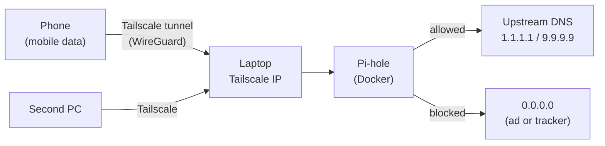
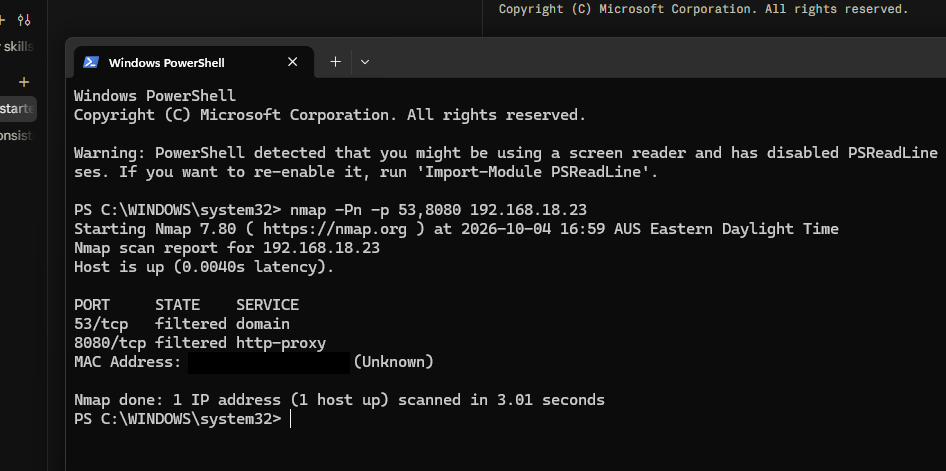
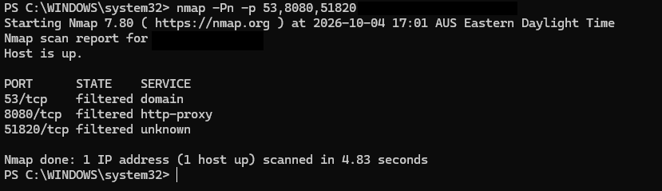
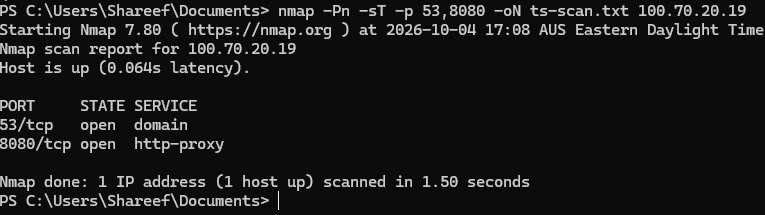
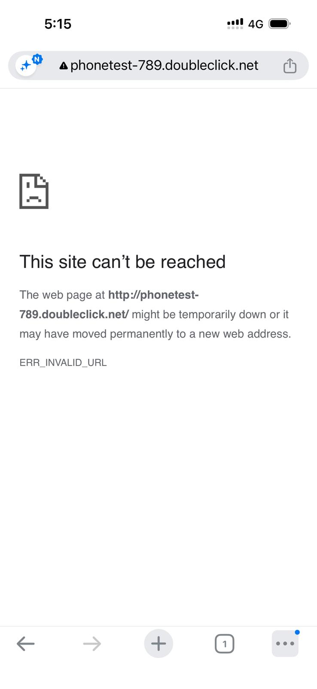
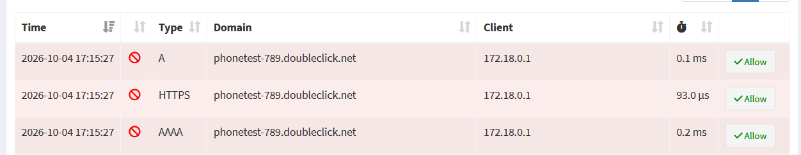

# Pi-hole over Tailscale: ad blocking for my phone on mobile data

A Pi-hole DNS sinkhole running in Docker on a Windows laptop, reachable only through a Tailscale tailnet. My phone uses it as its DNS from anywhere, so ads and trackers are blocked on mobile data too. **No router port is forwarded and nothing is exposed to the LAN or the internet.**

## Why Tailscale and not a self-hosted WireGuard server
My first plan was wg-easy plus a forwarded UDP port. I do not control the router, and the ISP may use CGNAT, so port forwarding was not an option. Tailscale makes outbound connections only, which works behind CGNAT and double NAT.

## Architecture

Tailscale runs on the Windows host. Only Pi-hole runs in Docker. Its ports are published on the laptop's Tailscale IP, so they exist only on the tailnet.

## Evidence

### Exposure scans (nmap 7.80)

| Vantage point | Target | Ports | Result |
|---|---|---|---|
| Same Wi-Fi, Tailscale off | laptop LAN IP | 53/tcp, 8080/tcp | filtered |
| Phone hotspot (other network) | home public IP | 53, 8080, 51820 (tcp) | filtered |
| Tailnet member | laptop Tailscale IP | 53/tcp, 8080/tcp | **open** |

Only tailnet members can reach Pi-hole. The tailnet scan used `-sT` (TCP connect) because nmap's raw SYN scan cannot use Tailscale's layer 3 virtual interface. Scans covered TCP only.

### Phone on mobile data is filtered by Pi-hole
I opened `phonetest-789.doubleclick.net` on the phone over 4G with Wi-Fi off. The name was typed only on the phone, so its appearance in the Pi-hole log shows the query arrived through the tunnel. Before the name was denied, Pi-hole forwarded it upstream. After I added it to the denylist, it was blocked in under a millisecond.

## Hardening
- No port forwarded; no inbound port open to the internet.
- Pi-hole DNS (53) and admin page (8080) are bound to the Tailscale IP only. The admin page is also available on localhost.
- Admin password and settings live in `.env`, which is git-ignored.
- The container has its own bootstrap resolvers (`dns:` in the compose file). Without them a fresh install deadlocks: it inherits the host's Tailscale DNS (Pi-hole itself) and cannot download its blocklists.
- Pi-hole v6 `FTLCONF_dns_listeningMode=all` is required behind Docker NAT, and is safe here only because of the Tailscale-IP binding above.

## Setup
See [WINDOWS-SETUP.md](WINDOWS-SETUP.md). In short: install Tailscale, Docker Desktop (WSL2), copy `.env.example` to `.env`, run `docker compose up -d`, then set the laptop's Tailscale IP as a custom nameserver with "Override DNS servers" in the Tailscale admin console.

## Limits
- **Client IPs are masked.** Docker Desktop on Windows NATs every query, so all clients appear as `172.18.0.1` in the log. I identified devices by unique test domains and timestamps. A Linux host with host networking would show per-device addresses.
- **The laptop is the single point of failure.** If it sleeps or reboots, DNS for every device on the tailnet fails.
- **Scans covered TCP only.** A UDP scan returns `open|filtered` at best, so it cannot prove a UDP port is closed.
- **Unpinned image.** `pihole/pihole:latest` should be pinned to a version.
- **Trust in Tailscale's coordination server.** Headscale would remove it.
- **DNS blocking only.** It does not stop ads served from the same domain as content, and apps with their own encrypted DNS (or iCloud Private Relay) bypass it.

## What I would change on a real server
- Run on a Raspberry Pi or mini PC on Linux, always on, with a fixed address.
- Pin image versions, enable automatic updates through a controlled process, and back up `pihole_etc`.
- Host networking or macvlan for real client IPs.
- Self-host the control plane (Headscale) and add Tailscale ACLs that limit which devices may reach port 53 and the admin page.
- Add a second Pi-hole for failover.
